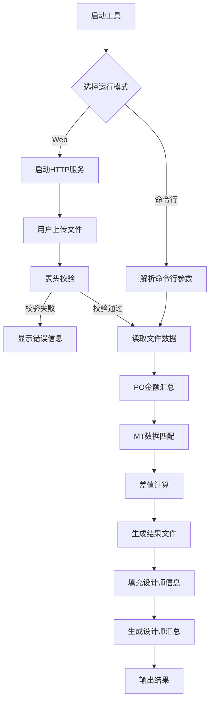

# Excel 数据处理工具需求规格说明书

## 1. 需求概述
根据业务场景，需要开发一个 Excel 数据处理工具，用于处理 `receipt.xls` 和 `MT.xlsx` 两个文件，实现数据匹配、金额计算和结果导出功能。工具需支持 **命令行模式** 和 **Web 服务模式** 两种运行方式。

## 2. 功能需求
### 2.1 文件读取与表头校验
| 功能点 | 描述 | 约束条件 |
| ---- | ---- | ---- |
| 文件格式支持 | 支持 .xls 和 .xlsx 格式 | receipt 文件通常为 .xls，MT 文件为 .xlsx |
| receipt 表头校验 | 必须包含指定列： - C列：采购订单号 - K列：未付款金额 - P列：执行设计师 | 列索引从0开始：C=2, K=10, P=15 |
| MT 表头校验 | 必须包含指定列： - M列：PO单号 - L列：预估费用 - G列：执行设计师 | 列索引从0开始：M=12, L=11, G=6 |

### 2.2 核心业务逻辑
| 功能点 | 描述 | 详细说明 |
| ---- | ---- | ---- |
| PO单号汇总 | 在 receipt 文件中按 C列（采购订单号）分组 | 对每个 PO 对应的 K列（未付款金额）求和 |
| PO匹配筛选 | 在 MT 文件中匹配 receipt 中存在的 PO | 根据 receipt 汇总的 PO 列表筛选 MT 数据 |
| 差值计算 | 计算每个匹配 PO 的差值 | 差值 = 未付款金额(AA) - 预估费用 |
| 设计师映射 | 从 MT 文件提取 PO -> 设计师映射关系 | 用于后续填充 receipt |
| 设计师信息填充 | 将设计师信息写回 receipt 文件 | 按品类经理和设计师排序 |
| 设计师汇总 | 在 receipt 结果文件中新增汇总 Sheet | 按设计师汇总未付款金额 |

### 2.3 输出文件
| 输出文件 | 内容 | 命名规则 |
| ---- | ---- | ---- |
| result.xlsx | MT 匹配结果 + 差值列 | `{时间戳}_result.xlsx` |
| receipt_filled.xlsx | 填充设计师后的 receipt + 汇总 Sheet | `{时间戳}_receipt_filled.xlsx` |

### 2.4 运行模式
| 模式 | 启动方式 | 适用场景 |
| ---- | ---- | ---- |
| 命令行模式 | `./bx_mt_project -receipt <path> -mt <path>` | 脚本化、自动化任务 |

## 3.技术要求
| 要求 | 说明 |
| ---- | ---- |
| 编程语言 | Go 1.24+ |
| Excel 处理库 | github.com/xuri/excelize/v2（xlsx） github.com/extrame/xls（xls） |
| 并发安全 | 支持多用户同时上传处理 |
| 错误处理 | 文件读取失败、格式错误、列缺失等异常情况需友好提示 |

## 4. 业务流程

## 5. 输入输出示例
### 5.1 输入文件结构
#### receipt.xls（部分列）
| 列索引 | 列名 | 示例值 |
| ---- | ---- | ---- |
| C (2) | 采购订单号 | PO2024001 |
| K (10) | 未付款金额 | 1500.00 |
| P (15) | 执行设计师 | （空，待填充） |

#### MT.xlsx（部分列）
| 列索引 | 列名 | 示例值 |
| ---- | ---- | ---- |
| G (6) | 执行设计师 | 张三 |
| L (11) | 预估费用 | 1200.00 |
| M (12) | PO单号 | PO2024001 |

### 5.2 输出文件结构
#### result.xlsx（新增列）
| 列索引 | 列名 | 说明 |
| ---- | ---- | ---- |
| W (22) | 差值(AA-预估费用) | 计算结果列 |

#### receipt_filled.xlsx（新增Sheet）
| Sheet名称 | 内容 |
| ---- | ---- |
| Sheet1 | 原始数据 + 填充的设计师列 |
| 设计师汇总 | 按设计师分组的未付款金额汇总表 |