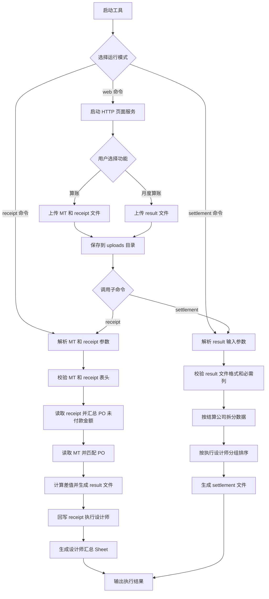

# Excel 数据处理工具需求规格说明书

## 1. 需求概述

本次版本支持三类核心能力：

- `receipt` 算账：读取 `MT` 文件和 `receipt` 文件，完成 PO 匹配、金额差值计算、设计师信息回写和设计师汇总。
- `settlement` 月度算账：读取 `result.xlsx` 文件，按 `结算公司` 拆分多个 Sheet，并生成月度结算文件。
- `web` 网页运行模式：通过浏览器选择本地文件，上传到本地服务后自动调用 `receipt` 或 `settlement` 命令执行。

工具需继续支持命令行模式，同时支持 Web 页面模式和 Docker 部署模式。

## 2. 功能需求

### 2.1 文件读取与表头校验

| 功能点              | 描述                                   | 约束条件                                                                                                                    |
| ---------------- | ------------------------------------ | ----------------------------------------------------------------------------------------------------------------------- |
| receipt 文件读取     | 支持读取 `.xls` 和 `.xlsx` 格式的 receipt 文件 | 命令行参数为 `-receipt`，Web 页面字段为 `receipt 文件`                                                                                |
| MT 文件读取          | 支持读取 `.xls` 和 `.xlsx` 格式的 MT 文件      | 命令行参数为 `-mt`，Web 页面字段为 `MT 文件`                                                                                          |
| result 文件读取      | 支持读取 `.xlsx` 格式的 result 文件           | `settlement` 月度算账仅支持 `.xlsx`                                                                                            |
| receipt 表头校验     | 按模板校验 receipt 文件表头                   | 模板文件路径：`template/receipt.xls` 或 `template/receipt.xlsx`                                                                 |
| MT 表头校验          | 按模板校验 MT 文件表头                        | 模板文件路径：`template/MT.xlsx` 或 `template/MT.xls`                                                                           |
| settlement 输入列校验 | 输入 result 文件必须包含指定业务列                | 必需列：`需求方事业部`、`需求ID`、`PO单号`、`需求名称`、`设计类型`、`执行设计师`、`实际金额`、`开票日期`、`结算公司`                                                   |
| 默认文件读取           | 命令行参数为空时读取默认目录文件                     | `receipt` 默认读取 `File/receipt.xlsx`、`File/receipt.xls`、`File/MT.xlsx`、`File/MT.xls`；`settlement` 默认读取 `File/result.xlsx` |
| Web 文件上传         | 页面选择本地文件后上传到服务端 `uploads` 目录         | 浏览器无法直接获取真实本地路径，服务端使用上传后的本地路径执行命令                                                                                       |

### 2.2 核心业务逻辑

| 功能点                 | 描述                           | 详细说明                                           |
| ------------------- | ---------------------------- | ---------------------------------------------- |
| receipt PO 汇总       | 在 receipt 文件中按采购订单号汇总未付款金额   | 使用 C 列 `采购订单号` 分组，对 K 列 `未付款金额` 求和             |
| MT PO 匹配            | 在 MT 文件中匹配 receipt 汇总得到的 PO  | 使用 M 列 `PO单号` 与 receipt 的采购订单号匹配               |
| **差值计算**            | 计算每个匹配 PO 的差值                | 差值 = receipt 未付款金额汇总值 - MT 预估费用                |
| **result 补充字段**     | 在 result 输出中补充差值、结算公司、设计类型   | 根据执行设计师匹配 `config/designers.json` 中的配置         |
| result 排序           | 对 result 输出数据排序              | 先按 E 列对接设计师第一个名字排序，再按 G 列执行设计师排序               |
| receipt 设计师回写       | 将 MT 中的执行设计师写回 receipt 输出文件  | 使用 PO -> 执行设计师映射，写入 receipt 的 P 列              |
| receipt 排序          | 对回写后的 receipt 数据排序           | 先按 L 列品类经理排序，再按 P 列执行设计师排序                     |
| 设计师汇总               | 在 receipt 输出文件中新增设计师汇总 Sheet | 按 P 列执行设计师汇总 K 列未付款金额，并输出总计                    |
| settlement 拆分       | 将 result 文件按 `结算公司` 拆分 Sheet | 每个结算公司生成一个 Sheet，空结算公司归为 `未配置结算公司`             |
| settlement Sheet 命名 | 生成合法且不重复的 Sheet 名称           | 替换 Excel 非法字符，名称长度控制在 31 个字符以内，重复时追加序号         |
| settlement 设计师分组    | 每个结算公司 Sheet 内按执行设计师分组       | 相同设计师数据连续，不同设计师之间空两行                           |
| settlement 开票日期     | 输出文件的 `开票日期` 从输入 result 文件读取 | 输入文件必须存在 `开票日期` 列，并填充到输出 settlement 的 `开票日期` 列 |

### 2.3 输出文件

| 输出文件                 | 内容                                  | 命名规则                                                 |
| -------------------- | ----------------------------------- | ---------------------------------------------------- |
| result.xlsx          | MT 匹配结果、差值、结算公司、设计类型                | 默认输出到 `output/{yyyyMMdd_HHmmss}_result.xlsx`         |
| receipt\_filled.xlsx | 回写执行设计师后的 receipt 文件，并新增设计师汇总 Sheet | 默认输出到 `output/{yyyyMMdd_HHmmss}_receipt_filled.xlsx` |
| settlement.xlsx      | 按结算公司拆分后的月度结算文件                     | 默认输出到 `output/{yyyyMMdd_HHmmss}_settlement.xlsx`     |

#### settlement 输出列

| 列名     | 来源              | 说明              |
| ------ | --------------- | --------------- |
| 需求方事业部 | 输入 result 文件同名列 | 原样写入            |
| 需求ID   | 输入 result 文件同名列 | 原样写入            |
| PO单号   | 输入 result 文件同名列 | 原样写入            |
| 需求名称   | 输入 result 文件同名列 | 原样写入            |
| 设计类型   | 输入 result 文件同名列 | 原样写入            |
| 执行设计师  | 输入 result 文件同名列 | 用于 Sheet 内部分组排序 |
| 结算公司金额 | 空值              | 预留手工填写          |
| 实际金额   | 输入 result 文件同名列 | 原样写入            |
| 开票日期   | 输入 result 文件同名列 | 原样写入            |
| 结算公司   | 输入 result 文件同名列 | 用于拆分 Sheet      |

### 2.4 补充网页运行模式说明

| 功能点         | 描述                                         | 约束条件                                                                    |
| ----------- | ------------------------------------------ | ----------------------------------------------------------------------- |
| Web 启动命令    | 通过 `web` 子命令启动本地页面                         | `go run . web` 或 `./bx_mt_project web -addr :8080`                      |
| 页面访问地址      | 默认访问 `http://localhost:8080`               | 地址可通过 `-addr` 参数调整                                                      |
| 第一组：算账      | 页面包含 `MT 文件`、`receipt 文件` 两个文件选择框和 `执行` 按钮 | 上传后服务端执行 `receipt -mt <MT上传路径> -receipt <receipt上传路径>`                  |
| 第二组：月度算账    | 页面包含 `result 文件` 文件选择框和 `月度算账` 按钮          | 上传后服务端执行 `settlement -input <result上传路径>`                               |
| 上传文件保存      | Web 服务将上传文件保存到 `uploads` 目录                | 文件名包含时间戳和字段名，避免重名覆盖                                                     |
| 执行结果展示      | 页面展示接口返回的执行状态和命令日志                         | 成功和失败使用不同样式展示                                                           |
| Docker 运行   | 镜像默认启动 Web 服务                              | `dockerfile` 中默认执行 `./bx_mt_project web -addr :8080`                    |
| Docker 端口映射 | 本地浏览器访问 Docker 服务需要运行时映射端口                 | `docker compose` 使用 `ports: "8080:8080"`；`docker run` 使用 `-p 8080:8080` |
| Docker 目录挂载 | 建议挂载输出和上传目录                                | `./output:/app/output`、`./uploads:/app/uploads`                         |

## 3. 技术要求

| 要求        | 说明                                                               |
| --------- | ---------------------------------------------------------------- |
| 编程语言      | Go 1.21+                                                         |
| Excel 处理库 | `github.com/xuri/excelize/v2`（xlsx）`github.com/extrame/xls`（xls） |
| 运行模式      | 支持 `receipt`、`settlement`、`web` 三个子命令                            |
| Web 服务    | 使用 Go 标准库 `net/http` 提供页面和上传接口                                   |
| 命令复用      | Web 上传后复用当前可执行文件调用已有子命令，避免重复实现业务逻辑                               |
| Docker 镜像 | 使用多阶段构建，运行阶段基于 `alpine:3.20`                                     |
| 目录要求      | 运行时需存在 `output` 和 `uploads` 目录                                   |
| 错误处理      | 文件缺失、格式错误、表头缺失、命令执行失败时需要返回明确错误信息                                 |

## 4. 业务流程



## 5. 输入输出示例

### 5.1 输入文件结构

#### receipt.xls / receipt.xlsx（关键列）

| 列索引    | 列名    | 示例值       |
| ------ | ----- | --------- |
| C (2)  | 采购订单号 | PO2024001 |
| K (10) | 未付款金额 | 1500.00   |
| L (11) | 品类经理  | 李四        |
| P (15) | 执行设计师 | 空值或待回写    |

#### MT.xls / MT.xlsx（关键列）

| 列索引    | 列名    | 示例值       |
| ------ | ----- | --------- |
| G (6)  | 执行设计师 | 张三        |
| L (11) | 预估费用  | 1200.00   |
| M (12) | PO单号  | PO2024001 |

#### result.xlsx（settlement 输入关键列）

| 列名     | 示例值          | 说明                    |
| ------ | ------------ | --------------------- |
| 需求方事业部 | 商业化          | 输出到 settlement        |
| 需求ID   | REQ202606001 | 输出到 settlement        |
| PO单号   | PO2024001    | 输出到 settlement        |
| 需求名称   | 物料设计         | 输出到 settlement        |
| 设计类型   | 包装           | 输出到 settlement        |
| 执行设计师  | 张三           | 用于 Sheet 内分组          |
| 实际金额   | 1500.00      | 输出到 settlement        |
| 开票日期   | 2026-06-01   | 输出到 settlement 的开票日期列 |
| 结算公司   | 万象更芯         | 用于拆分 Sheet            |

### 5.2 输出文件结构

#### result.xlsx（新增列）

| 列名   | 说明                                  |
| ---- | ----------------------------------- |
| 差值   | receipt 未付款金额汇总值 - MT 预估费用          |
| 结算公司 | 根据执行设计师从 `config/designers.json` 匹配 |
| 设计类型 | 根据执行设计师从 `config/designers.json` 匹配 |

#### receipt\_filled.xlsx（新增内容）

| Sheet 名称 | 内容                        |
| -------- | ------------------------- |
| Sheet1   | 原始 receipt 数据 + 回写后的执行设计师 |
| 设计师汇总    | 按执行设计师汇总未付款金额，并生成总计       |

#### settlement.xlsx（新增 Sheet）

| Sheet 生成规则     | 内容                           |
| -------------- | ---------------------------- |
| 每个结算公司一个 Sheet | Sheet 名称使用结算公司名称             |
| 未配置结算公司        | 结算公司为空时归入 `未配置结算公司` Sheet    |
| Sheet 内排序      | 按执行设计师分组，相同设计师连续，不同设计师之间空两行  |
| 开票日期           | 从输入 result 文件的 `开票日期` 列读取并写入 |

## 6. 部署与运行说明

### 6.1 命令行运行

```bash
go run . receipt \
  -mt /path/to/MT.xlsx \
  -receipt /path/to/receipt.xls
```

```bash
go run . settlement \
  -input /path/to/result.xlsx
```

### 6.2 本地 Web 运行

```bash
go run . web
```

访问：

```text
http://localhost:8080
```

### 6.3 Docker 运行

使用 Docker build ：

```bash
docker build --pull=false -f dockerfile -t bx_mt_project:latest .
```
加载镜像 ：
```bash
docker load -i bx_mt_project_latest.tar
```

使用 Docker Run：

```bash
docker run -d --name bx_mt_project_web \
  -p 8080:8080 \
  -v /your/host/output:/app/output \
  -v /your/host/uploads:/app/uploads \
  bx_mt_project:latest
```

访问：

```text
http://localhost:8080
```


